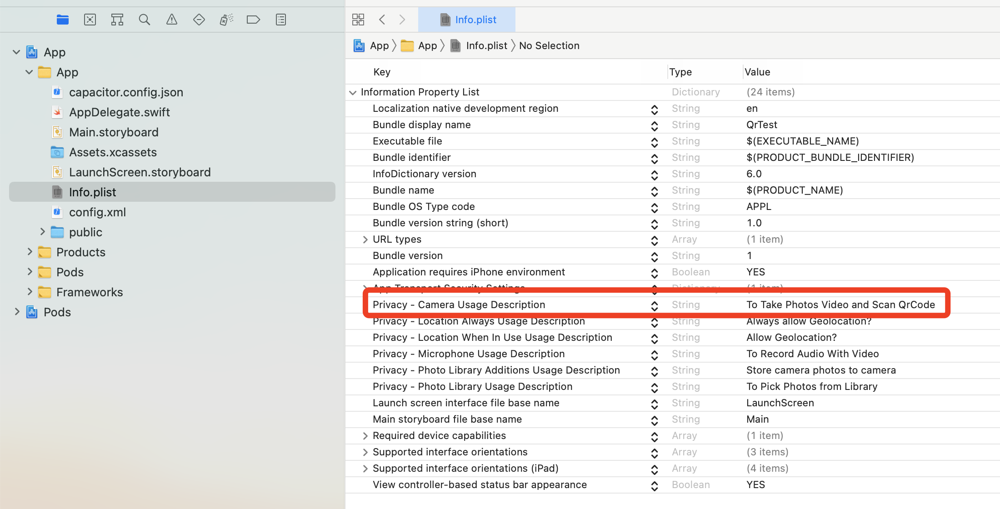

# Welcome to the Capacitor QR Code Scanner

This repository is a capacitor plug in for scanning QR Codes on Android and iOS.

# Table of contents

- [Installation](#Installation)
- [Usage](#Usage)

## Installation

To install from the command line:

````shell
npm i @diningcity/capacitor-qr-scanner;
npx cap sync;

or

npm i @diningcity/capacitor-qr-scanner;
ionic capacitor copy;
(https://ionicframework.com/docs/cli/commands/capacitor-copy)
````
**NOTE:** After install the plug-in, you should add some settings and code snippets into your navite project.

### iOS
1. Open the ios project with Xcode from your project and add camera usage description in info.plist as following

````
<key>NSCameraUsageDescription</key>
<string>{Your camera usage description}</string>

ex: App would like to use camera to scan QRCode.

````

or

You can add this directly without coding with Xcode as following



2. That's all

### Android
1. Open the android project with android studio and you should register the plugin class in MainActivity.java as follows

````
public class MainActivity extends BridgeActivity {
      @Override
      public void onCreate(Bundle savedInstanceState) {
        super.onCreate(savedInstanceState);
        // Initializes the Bridge
        this.init(savedInstanceState, new ArrayList<Class<? extends Plugin>>() {{
          // Additional plugins you've installed go here
          add(QrScanner.class);
        }});
      }
    }
````

2. Add CodeScannerActivity into AndroidManifest.xml

````
<activity        android:configChanges="orientation|keyboardHidden|keyboard|screenSize|locale|smallestScreenSize|screenLayout|uiMode"
        android:name="asia.diningcity.qrscan.CodeScannerActivity"
        tools:ignore="Instantiatable">
    </activity>
````
3. Compile the android project, android studio will show build error. Replace all ````android.support.v4.content.FileProvider```` with ````androidx.core.content.FileProvider```` and build again.

4. That's all

## Usage

To import the following into your code

````react
import { QrScanner } from '@diningcity/capacitor-qr-scanner';
import React from "react";

const Test = () => {
    async function scanQR() {
      const {camera} = await QrScanner.requestPermissions();
      if (camera == "granted") {
        const {result} = await QrScanner.scanQrCode();
        alert(result);
      } else {
        alert("You should allow camera permission.");
      }
    }
    return (
        <React.Fragment>
            <div onClick={() => scanQR()}>
            </div>
        </React.Fragment>
    );
};

````